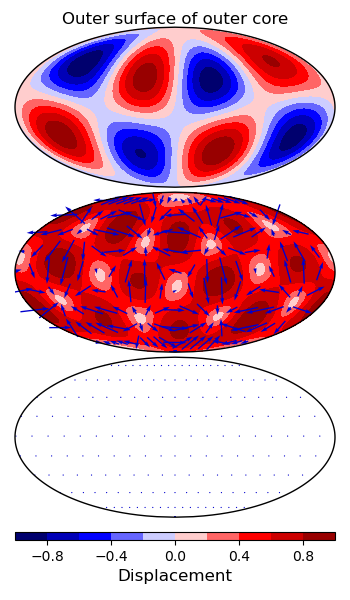

# NMPostProcess

*Python* codes for processing and plotting the output of the [*NormalModes*](https://github.com/js1019/NormalModes) library.

### Table of contents

  * [Dependencies](#dependencies)
  * [How to install the code](#how-to-install-the-code)
  * [Files required for post-processing](#files-required-for-post-processing)
  * [How to run a 'quick projection'](#how-to-run-a-quick-projection)
  * [How to run automatic mode identification](#how-to-run-automatic-mode-identification)
  * [How to run a 'full projection'](#how-to-run-a-full-projection)
  * [How to do projections in parallel](#how-to-do-projections-in-parallel)
  * [Description of the processing steps](#description-of-the-processing-steps)
  * [Known issues](#known-issues)
  * [Contributors and version history](#contributors-and-version-history)
  * [How to contribute](#how-to-contribute)
  * [How to acknowledge this code](#how-to-acknowledge-this-code)

<a style="color: #000000" name="dependencies"/>

## Dependencies
  
It is necessary to install [*Python*](https://www.python.org/) and the following *Python* libraries:

* [*NumPy*](https://numpy.org/) and [*SciPy*](https://www.scipy.org/);
* [*MatPlotLib*](https://matplotlib.org/) and [*Cartopy*](https://scitools.org.uk/cartopy/docs/latest/) for plotting;
* [*SHTns*](https://www2.atmos.umd.edu/~dkleist/docs/shtns/doc/html/), for projection into vector spherical harmonics;
* [*ssrfpy*](https://github.com/ian-r-rose/ssrfpy), for interpolation on a sphere.

<a href="#top">Back to top</a>

<a style="color: #000000" name="how-to-install-the-code"/>

## How to install the code

Make a copy of this repository. It should then be ready to use.

<a href="#top">Back to top</a>

<a style="color: #000000" name="files-required-for-post-processing"/>

## Files required for post-processing

### The *PlanetaryModels* input files

The [*PlanetaryModels*](https://github.com/js1019/PlanetaryModels) mesh files used by *NormalModes* are required for post-processing, in a single directory. Post-processing reads the `.ele`, `.node`,  and `.neigh` files, although currently only the `.node` file is actually used.

You should also place a file in this directory called `radii.txt`. The first line is the state of the outermost spherical shell (`solid` or `fluid`). The remaining lines are the radial coordinates of the solid-fluid discontinuities in decreasing order, preceded by the radius of the planet (in km). If the planet has no fluid-solid discontinuities, this file only has two lines (state and radius). An example is shown for an Earth model:

```
solid
6371.0
3480.0
1221.5
```

### The *NormalModes* output files

A successful *NormalModes* run will produce the files listed below, in a single directory. Items 1–4 are necessary for post-processing. These files are detected by *NMPostProcess* by matching regular expressions, so, to avoid errors, you should not add other files to this directory.

1. The mode files (e.g. `mod.1_JOB1_pod1_np48_0.1000000_1.000000_1.dat`). There is one file per mode, and they are listed in order of increasing frequency, as indicated by the final integer in the file name. Each file contains displacement  vector field for one mode: the three components of the mode's displacement at each solution point (including second-order points).
2. The vertex index file (e.g. `mod.1_pod1_np48_vlist.dat`). The vertex indices are integers (one per solution point) which map between the solution points and the mesh node points. This is necessary because some node points have displacement specified twice, on either side of a boundary. For more information, see the docstring for `process.read_eigenvector()`.
3. The vertex attribute file (e.g. `mod.1_pod1_np48_stat.dat`). The vertex attributes are integers (one per mesh node) indicating whether the grid point is solid, fluid, or solid-fluid, and whether it is a first- or second-order point. For more information, see the docstring for `process.read_eigenvector()`.
4. The `sbatch` standard output log (e.g. `LLSVP_6222017.txt`). This contains detailed progress information as well as printing out the relative errors and the mode frequencies.
5. The log file (e.g. `mod.1_0.log`) contains brief progress information output by the code. Sometimes it is useful for error messages or timing information.
6. The `sbatch` error log (e.g. `LLSVP_6222017.err`). Hopefully this file will be empty or only contain warnings, but if something goes wrong, it will be reported here.

All the `.dat` files (items 1, 2 and 3 above) are stored in a *Fortran* binary format. They can be read in *Python* using `numpy.fromfile()`, e.g.

```python
vert_idxs   = numpy.fromfile('mod.1_pod1_np48_vlist.dat', dtype = '<i') 
```

### The *NMPostProcess* input file

The file `input_NMPostProcess.txt` controls the post-processing. The first three lines are

1. The path to the directory containing the *PlanetaryModels* input files.
2. The path to the directory containing the *NormalModes* input files.
3. An string specifying the processing options described in the following sections:
  * `quick`Find the vector spherical harmonic expansion for a single radial coordinate.

An example of the first three lines of the  *NMPostProcess* input file is here:

```
/example/output/PlanetaryModels/LLSVP/prem_0439.4_2.00_1/
/example/output/NormalModes/prem_0439.4_2.00_1_00.10_01.00_1/
quick
...
```

<a href="#top">Back to top</a>

<a style="color: #000000" name="how-to-run-a-quick-projection"/>

## How to run a 'quick projection'

To select 'quick projection', set the third line `input_NMPostProcess.txt` to `quick`. The remaining two lines should be
 
<ol start="4">
<li> The maximum angular order of the expansion.</li>
<li> The number of the mode.</li>
</ol>
  
For example, to project mode number 15 using a maximum -value of 10, call the command

```
python3 project.py
```

with the following input file

```
/example/path/output/PlanetaryModels/LLSVP/prem_0439.4_2.00_1/
/example/path/output/NormalModes/prem_0439.4_2.00_1_00.10_01.00_1/
quick
10
15
```

The mode number can also be set as `all` to loop over all modes (this can be slow for large runs).

Choosing the maximum -value should be based on the expected spatial wavelength of the modes, which depends on the upper frequency limit of the *NormalModes* run. For example, on Earth, we see that modes have -values less than approximately , where  where  is the frequency in mHz. In this example, the run had an upper frequency limit of 1.0 mHz, so a maximum -value of 10 was appropriate. Similar relationships can deduced for other planets using spherically-symmetric codes such as [*Mineos*](https://geodynamics.org/cig/software/mineos/). Choosing a maximum -value that is much too high will slow down the processing and may increase numerical noise. If it is too low, the expansion of the spatial patterns will be truncated, causing aliasing and mode misidentification.

The maximum -value also controls the spacing of the regular longitude-latitude grid used in the interpolation step (see following section). The number of latitude grid points is chosen to be , and the number of longitude grid points is twice this many, which should be sufficient to avoid aliasing.

### The projection output files

The projection will create a number of output files in the *NormalModes* output directory, in a new subdirectory called `processed/`. Some of them are simply the *NormalModes* output re-written in a more convenient form:

* `eigenvalue_list.txt` A list of mode number and frequency.
* `indices_discon_*.txt` Each of these files contains a list of the indices of the sample points belonging to one of the solid-fluid discontinuities. They are labelled `0`, `1`, ... starting at the innermost discontinuity. The last one is the outer surface (this will be the only file if there are no internal discontinuities).
* `indices_interior_*.txt` Similar to the discontinuity files, listing the indices of sample points belonging to each interior region, starting with the innermost region.
* `nodes.txt` The coordinates of the nodes of the mesh (including second-order nodes).

The projected output is a series of *SHTns* complex vector spherical harmonics, which are written to *NumPy* binary files `quick_spectral_*.npy` in the `processed/spectral/` subdirectory. The mode number is indicated in the file name. There are three kinds of coefficients (radial , consoidal  and toroidal ) and one header line, so each file stores array of shape  where  is the number of coefficients. The number of coefficients is . The coefficients are stored in the order used by *SHTns*.

### How to plot the projection output

The VSH projection can be plotted with the command

```
python3 plot/plot_displacement.py
```

which is controlled by the input file `input_plotting.txt`. The first line of this file controls the type of plot: `spatial` or `spectral`, which are described below. The plots will appear in the `processed/plots/` subdirectory.

#### Spatial plots

 A spatial plot displays a map representation of the three components (radial, consoidal and spheroidal) of the vector field in three panels. Here we have an example of a low-frequency mode of a spherically-symmetric Earth model, neglecting gravity:
 


We can see this mode is a spheroidal mode (no toroidal component). Note that the consoidal and toroidal components (lower two panels) are surface vector fields with both a direction (indicated by arrows) and a magnitude. Their magnitude is shown using only the positive part of the colour bar. The radial component (top panel) has a fixed direction can be positive (outwards) or negative (inward).

A spatial plot input file looks like this

```
spatial
15
png
90
```

where the second line is the mode number (can also be `all`), the third line is the output figure format (currently supports `png` and `pdf`), and fourth line is the number of latitude grid points (see discussion in 'Using the code: Quick projection'). The spatial field is calculated by re-projecting the VSH coefficients.

The figure title gives the radial coordinate of the projection (the radius at which the maximum displacement occurs). An optional file `shell_names.txt` can be placed in the `processed/` directory to give more descriptive names to the regions between solid-fluid discontinuities. For example, for Earth (with no crust), an appropriate shell-name file is

```
mantle
outer core
inner core
```

#### Spectral plots

For the same example as above, if we change the plot input file to 

```
spectral
15
png
```

we get a spectral plot:


This shows the VSH coefficients (radial , consoidal  and toroidal ). They have been converted from complex to real format (so they range from  to ). We can see that this mode is dominantly spheroidal with . We also know the frequency of the mode (0.415 mHz) from the `eigenvalue_list.txt` file. Comparison with calculations of a spherically-symmetric Earth then allows us to identify this mode as one of the seven nearly-degenerate modes of Earth's  multiplet.

<a href="#top">Back to top</a>

<a style="color: #000000" name="how-to-run-automatic-mode-identification"/>

## How to run automatic mode identification

The dominant -value and mode type (spheroidal or toroidal) can be determined automatically from the power distribution VSH coefficients. To do this, process each mode as described above using `process.py`. Then run

```
python3 characterise.py
```

This first creates a file `characterisation_quick.npy` in the processed output directory. This stores an array of shape  where  is the number of modes. The rows of the array are:

* 0, 1, 2: The spectral 'power', , in the ,  and  components, for example .
* 3, ..., 3 + : The spectral 'power' in each -band, defined as .
* 4 + : The radius at which the maximum displacement occurs.
* 5 + : The 'region' in which the maximum displacement occurs. The region is an integer starting at 0 for the free surface, 1 for the interior of the first shell, 2 for the lower surface of the first shell, 3 for the upper surface of the second shell, and so on.

This information is then used to identify the modes. The mode identification is saved in the file `mode_ids.txt`. The file has one row per mode. Each row contains four integers, giving

1. The mode number.
2. The -value.
3. The mode type (0 for radial, 1 for spheroidal, and 2 for toroidal).
4. The shell within which the maximum displacement occurs. This is used for distinguishing toroidal modes in different solid regions.

For example, the mode plotted in the previous examples has the following line:

```
15 3 1 1
```

meaning mode 15 has , is spheroidal, with maximum displacement in the outer core.

To plot the mode identifications, run

```
python3 plot/plot_mode_diagram.py
```

which produces a plot such as


This plot shows all of the spheroidal, toroidal and radial modes, as indicated in the legend. Note that 'T0' indicates 'toroidal modes from shell 0' where shell 0 is the outermost shell, in this case the mantle. At higher frequencies, we would also expect T2 modes (inner-core toroidal modes).

For spherically-symmetrical models, modes are expected to occur in 'multiplets' containing  modes of identical frequency. More generally, the multiplets will show small frequency splittings. The plotting code attempts to group the modes into clusters and will label multiplets with too many modes (in red) or too few modes (in green) for the given -value. In this example, we see that the multiplet  is missing 3 modes. This is because the mode has a frequency of almost exactly 1.0 mHz so falls on the boundary of the eigenvalue filter. All of the other modes are recovered (note that toroidal modes with  or  and the modes  and  cannot be generated by an internal source and are not returned by *NormalModes*).

The mode clustering information can be helpful for identifying numerical errors (usually caused by a too-coarse mesh) or coupled modes in non-spherical models. However, in more complicated models at higher frequencies it becomes difficult to automate the clustering, and the clustering information may not be meaningful. Users can try changing the clustering tolerance `f_tol` in the script `characterise.py`.

<a href="#top">Back to top</a>

<a style="color: #000000" name="how-to-run-a-full-projection"/>

## How to run a 'full projection'

'Full projection' calculates VSH coefficients on spherical surfaces with various radii from the centre of the planet to the surface, instead of the one radius used in quick projection. This means that full projection is slower, but it provides a full description of the mode displacement field throughout the planet. This can give more robust mode identifications.

Full projection has been implemented offline, but the code is not currently ready to include in this library.

<a href="#top">Back to top</a>

<a style="color: #000000" name="how-to-do-projections-in-parallel"/>

## How to do projections in parallel

The calculation of the VSH coefficients of one mode is independent of the calculation of the coefficients of any other mode. Therefore, it is straightforward to process all of the modes in parallel. This speeds up the calculation, which is especially useful for 'full projection'.

To use parallel processing, change the fifth line of `input_NMPostProcess.txt` from `all` to `parallel`.

Parallel processing is often more effective if you have access to a cluster with many cores. An example job script is given in `example_slurm.sbatch` for a [*Slurm*](https://slurm.schedmd.com/documentation.html) cluster. This script would be submitted to the cluster with the command `sbatch example_slurm.sbatch`. The script is very simple, but you must also make sure that the *NMPostProcesss* file is correct, the required *Python* modules are available on the cluster, and any local cluster rules are obeyed.

<a href="#top">Back to top</a>

<a style="color: #000000" name="description-of-the-processing-steps"/>

## Description of the processing steps

Vector spherical harmonics (VSHs) are the natural basis to describe the modes of spherically-symmetrical planets (see Dahlen and Tromp, 1998, chapter 8). They are also a good starting point for non-spherically-symmetric planets if the deviations from spherical symmetry are small. The main task of *NMPostProcess* is to project the vector displacement fields (eigenfunctions) of the modes calculated by *NormalModes* into VSHs to allow the modes to be identified. In particular, from the VSH expansion it is trivial to separate toroidal and spheroidal modes, and determine the -value of the mode. For these tasks it is usually sufficient to use the VSH expansion onto a single spherical surface. This is called 'quick projection'. Sometimes it is helpful to calculate the VSH expansion at various radial distances spanning the interior of the planet; we call this 'full projection'.

### Quick projection

The first step is to process information about the input model, creating convenience files with sample coordinates and indices identifying each region and boundary. Then the projection is performed as follows:

1. Load the eigenvector samples and the coordinates of these samples.
2. Discard samples from second-order nodes<sup>1</sup>.
3. Find the radial coordinate of the sample with the largest displacement. This is chosen as the radius of the sphere onto which the projection is done<sup>2</sup>.
4. Interpolate the 3D displacement field onto a regular grid over the sphere with the chosen radius (discontinuities are treated carefully).
5. Convert the Cartesian components of the displacement field to polar components (north, east, radial).
6. Transform the polar components to VSH coefficients.
8. Save the spectral displacement fields of the chosen radius.

<sup>1</sup>This step is not necessary, but it decreases the computational cost and in most circumstances will not impede the mode identification (a large number of nodes is required to accurately compute the mode frequencies, but the displacement patterns are usually long-wavelength and can be calculated and described with fewer nodes).

<sup>2</sup>The displacement patterns of a mode of a spherically-symmetrical planet is separable into a function of radius and a function of angular position. Therefore the results of the projection will differ only in amplitude if a different radius is used. However, it is still wise to choose the radius of maximum displacement, to avoid radial nodes where the displacement is zero.

### Full projection

Full projection uses the same processing steps as quick projection (steps 4–7), except there is an additional loop over the different values of radius.

<a href="#top">Back to top</a>

<a style="color: #000000" name="known-issues"/>

## Known issues

### Contour maps with *Cartopy*

Drawing filled contour maps with *Cartopy* can cause errors such as

```
AttributeError: 'PreparedGeometry' object has no attribute 'is_valid'
```

and other times it will fail to draw some contour levels without raising an error. Usually these issues go away if you change the map projection or the number of contour levels.

<a href="#top">Back to top</a>

<a style="color: #000000" name="contributors-and-version-history"/>

## Contributors and version history

* Version 1: Created by [Harry Matchette-Downes](http://web.mit.edu/hrmd/www/home.html). Includes 'quick' processing, and plotting of maps, spectra and mode diagrams.

### Future

We intend to add the following features:

* Full projection.
* Support for spheroidal (flattened) planets.

<a href="#top">Back to top</a>

<a style="color: #000000" name="how-to-contribute"/>

## How to contribute

Please feel free to contribute in the form of bug reports, bug fixes, feature requests, or new code.

<a href="#top">Back to top</a>

<a style="color: #000000" name="how-to-acknowledge-this-code"/>

## How to acknowledge this code

If you use this code as part of published work, please include an acknowledgement such as 'the *NormalModes* output was projected into vector spherical harmonics using the *NMPostProcess* software (https://github.com/harrymd/NMPostProcess)'.

<a href="#top">Back to top</a>